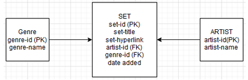
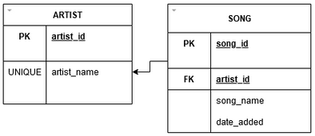
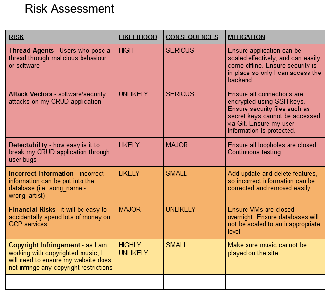
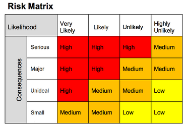
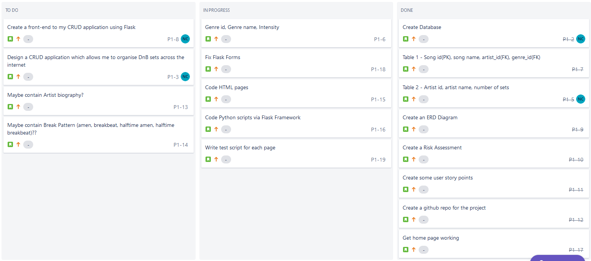

# Fundamental Project: Design and Create a CRUD application

## Brief

This project sets a goal of creating a CRUD application.

### Requirements

To achieve the objective of the project, I aim to include the following:

* A Jira Board
* A database which contains at least two tables that model a relationship
* Clear documentation of the design phase, app architecture, testing and risk assessment
* A python-based functional web application that optimises practices and design principles
* Unit testing and integration testing for the application
* A front-end website, created using Flask
* Code integrated into a Version Control System which will be built through a Jenkins CI Server and deployed to a cloud-based virtual machines

### My Approach

I will use Flask Framework in order to create the application

I will use Pytest in order to write and use testing scripts

I will use a mysql-database hosted on GCP to store data for my CRUD application

I will use HTML & Jinja2 in order to create a front-end to my application. 

I will use Jenkins in order to continuously test and integrate coding in my application.

The final application will have 2 tables, which will have a many-to-one relationship. 

## ERD Diagrams

### ORIGINAL ERD (many-to-many):

My original design stored DnB Mixes, not songs. As such, I would need a set title and hyperlinks. I also intended on adding a genre table, in order to further catogorise mixes. However, I deceded this was too complex for the scope, so decided to modify the idea. 

### FINAL ERD (many-to-one):

The final design will store DnB Songs and Artists in a many-to-one relationship. This is detailed in the ERD Diagram.

Further designs could encompass a genre table, which would relate to songs. 

## Risk Assessment

## Jira Board

### User Stories 
* As a DnB DJ, I would like to access lists of the back catalogues of artists I like
* As someone looking to get into DnB, I would like to find new music
* As someone who enjoys DnB, I would like to find new artists to listen to
* As someone who listens to DnB, I would like to be able to update the database with new songs so other people can enjoy listening to them
* As a user of the DnB Database, I would like to delete songs which are not DnB 
 
## Python

I will be coding my application to work using Python 3.9, as well as various plugins which will create, maintain and update the website. Python is a scripting language that is simple, easy to use, and effective with regards to what is required in the scope.

## Flask Framework 

I will be using Flask Framework in order to create my application. Flask is a lightweight Web Server Gateway Interface used for Python. It will allow me to create a friendly user interface capable of completing CRUD requests. It will also allow me to route to different pages on my website, using the @app.route command. 

## Pytest 

## Selenium

## Jinja2 and HTML

Jinja2 is a templating language used in conjuction with Python. It uses automatic HTML escaping, which will help prevent XSS attacks. It is easy to configure and debug, which makes it a perfect front-end to display the DnBDatabase.

## Git and Github 

## Jenkins 

## GCP Server 
